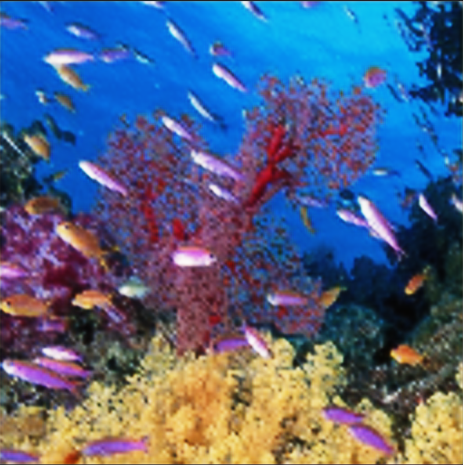

# Super-Resolution Autoencoder

Proyek ini merupakan implementasi Autoencoder untuk meningkatkan resolusi citra (Super-Resolution) menggunakan dataset **General-100**. Model dilatih untuk mengembalikan citra resolusi tinggi dari versi yang telah diturunkan resolusinya.

## 📂 Dataset

Dataset yang digunakan adalah **General-100**, yang terdiri dari 100 gambar dalam format BMP. Dataset ini sering digunakan untuk tugas-tugas super-resolution karena kualitasnya yang tinggi dan variasi objek yang cukup beragam.

- Lokasi: `data/general100/`
- Format gambar: `.bmp`
- Resolusi asli: variatif (umumnya tinggi)
- Proses preprocessing: gambar dikurangi resolusinya sebelum diberikan ke model

> Sumber: Dataset General-100 tersedia dari komunitas riset super-resolution.

## 🧠 Arsitektur Model

Model autoencoder terdiri dari dua bagian utama:

### Encoder
- Dua layer Conv2D + ReLU
- MaxPooling2D

### Decoder
- Dua layer Conv2DTranspose
- Aktivasi ReLU dan Sigmoid

```python
model = Sequential([
    Conv2D(64, (3,3), activation='relu', padding='same'),
    MaxPooling2D((2,2), padding='same'),
    Conv2D(32, (3,3), activation='relu', padding='same'),
    MaxPooling2D((2,2), padding='same'),
    
    Conv2DTranspose(32, (3,3), strides=2, activation='relu', padding='same'),
    Conv2DTranspose(64, (3,3), strides=2, activation='relu', padding='same'),
    Conv2D(3, (3,3), activation='sigmoid', padding='same')
])

📈 Performa Model
Model dilatih dengan:

Loss Function: Mean Squared Error (MSE)

Optimizer: Adam

Epoch: 250

Batch Size: 8

Loss selama pelatihan terus menurun, mencapai nilai stabil sekitar 0.005 setelah beberapa epoch.

## 📈 Rata‑rata Loss

| Metrik     | Nilai rata‑rata |
|------------|-----------------|
| `loss`     | **≈ 0.0030**    |
| `val_loss` | **≈ 0.0017**    |


## 🖼️ Contoh Input dan Output

Berikut perbandingan antara gambar input dan hasil rekonstruksi dari autoencoder:

| Input                          | Output                      | Target                      |
|--------------------------------|-----------------------------------|
|       |     |      |
|       |    |      |
|    |    |     |

Gambar di atas adalah gabungan dari hasil input, output model, dan target ground-truth dari dataset General-100. File output dapat ditemukan di direktori outputs/ dan file input di data/general100/.

🚀 Cara Menjalankan
Clone repositori ini:

bash
Salin
Edit
git clone https://github.com/username/super-resolution-autoencoder.git
cd super-resolution-autoencoder
Install dependencies:

bash
Salin
Edit
pip install -r requirements.txt
Jalankan pelatihan:

bash
Salin
Edit
python train.py
Prediksi citra:

bash
Salin
Edit
python predict.py --image path/to/image.bmp
📌 Catatan
Model ini adalah baseline sederhana.

Dapat dikembangkan lebih lanjut dengan arsitektur seperti UNet, ResNet, atau GAN.

